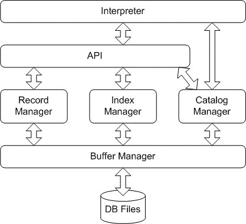

# MiniSQL-TeamLanTianLiuShe

- MiniSQL-TeamLanTianLiuShe is our Database System curriculum project based on C++11.
- **IndexManager** and **partial Interpreter** are implemented by [Xiaoqiang Wang](https://robert-xiaoqiang.github.io/)

|Other Authors| Assignments|
|:-----|-----:|
|[Ye Tian]()|BufferManager, Interpreter |
|[Yizhi Zhao]()|CatalogManager, API |
|[Zhengyan Lee]()| RecordManager, API|

## Features
- DDL
   - ATTRIBUTE TYPE: int, char(N), float
   - ATTRIBUTE INTEGRATY CONSTRAINT: primary key, unique, foreign key 
   - INDEX CREATE and DELETE
- DML
   - SFW with equal-value or range conditions
   - SFW with conjunction clauses
   - INSERT (single record)
   - DELETE (single or multiple record) 
## Build
#### Dependence & Reference
- C++11

#### Main
- /main.cpp

## Design Hierarchy

## Screenshots
- Console program 
- UI TO-DO
